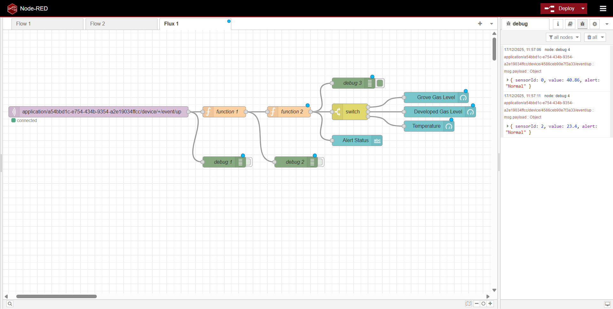
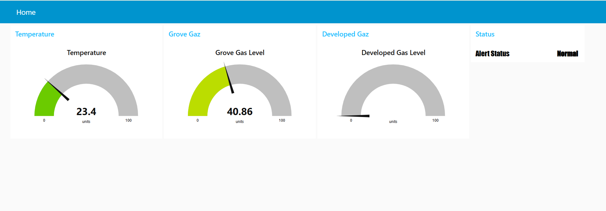

# Gas Sensor - IoT Project

This project presents the development of a complete gas sensor, from the fabrication of nanoparticles in the laboratory to the implementation of an IoT system with Arduino and Node-RED.

## MOx Sensor Manufacturing

During a week at the AIME laboratory of INSA Toulouse, we fabricated our own MOx (Metal Oxide) gas sensor. This chapter describes how the MOx gas sensor was fabricated, from the micro-structure on the chip to the final packaged component ready for tests. The main goal is to build a sensor with interdigitated electrodes and a metal-oxide active layer (WO₃), and to make sure it can be electrically connected and handled safely during measurements.

### 1.1 MOx Sensor Architecture

The sensor is based on a small chip that includes a heating element (to control the operating temperature) and metal electrodes where the metal-oxide material will be deposited. The device is designed so that the gas-sensitive layer can change its resistance depending on the surrounding atmosphere.

### 1.2 Photolithography

First, the polysilicon heating element (used to heat the MOx resistor, lower its resistance, and remove water residues) was already manufactured in the AIME clean room by professionals. It was obtained by depositing a polysilicon layer and then patterning it using a photoresist mask activated by UV light.

Then, metallization was performed by depositing a thin aluminum layer (about 500 nm) to create electrodes and electrical contacts. After that, metal etching defined the final electrode patterns by removing unwanted aluminum. This step used a resist coating, UV exposure with a mask, development, annealing cycles, and a chemical etching bath, with microscope inspections to verify quality after each stage.

### 1.3 Metal Oxide (MOx) Synthesis

The active sensing material is tungsten trioxide (WO₃). The synthesis process consists of two steps: first, seed preparation (chemical mixing and centrifugation to collect the precipitate), and second, nanowire growth using a hydrothermal process at high temperature, followed by rinsing and storage. This method aims to produce homogeneous nanostructures suitable for gas sensing.

To place the WO₃ nanoparticles onto the interdigitated electrodes, dielectrophoresis is used: a small drop of nanoparticle solution is deposited on the chip, and an AC voltage is applied to align the particles between the electrodes. After rinsing and drying, the chip is checked under an optical microscope to confirm a uniform and well-aligned active layer.

### 1.4 Packaging

Finally, the sensor is packaged using a JEDEC TO-5 metal can package with 10 pins. The chip is placed on a glass support to provide electrical isolation, and wire bonding is used to connect the chip pads to the package pins. This creates a robust component that can be connected to external electronics for characterization and integration.

## Sensor Characterization

After fabricating the sensor, we characterized two key parts of the device: the integrated thermistor (used to estimate temperature) and the MOx gas-sensing resistance (WO₃). The goal is to obtain practical electrical values that can later be used for conditioning, calibration, and integration into electronics.

### 2.1 Thermistor

The thermistor (called R_alu) is treated as a PTC component, meaning its resistance increases with temperature. Since it was not fully characterized, we assumed an approximate coefficient of 1 Ω per °C, based on a similarity with a Pt100-like behavior. A proper method would be to heat it while comparing with a reference thermometer, but this was not done, and the approximation was considered "good enough" for operating the MOx sensor.

To find the room-temperature reference resistance, we measured an I-V curve using a waveform generator and an instrumentation setup, then applied Ohm's law. The nominal resistance obtained was about 86 Ω at ambient temperature (around 21°C). We also observed non-linearity at higher voltage, likely caused by self-heating of the thermistor.

### 2.2 MOx Resistance

**Nominal resistance:** The WO₃ sensing layer has a very high resistance in its reduced form, in the GΩ range, which makes measurement difficult due to the need for a precise current source and because thermal noise becomes significant. As a result, the reported value is a rough estimate, but we obtained a typical resistance around 16 GΩ.

**Sensitivity to ethanol:** We performed an experiment to evaluate the sensor response to ethanol vapor. First, the sensor temperature is increased (around 550 K) to evaporate moisture and reduce resistance. Then the test is performed in two phases: a regeneration phase under dry air (to "regenerate" the sensor surface), followed by a detection phase under an ethanol/air mixture (about 1000 ppm). During exposure, the resistance drops with an exponential-like behavior.

From this test, we extracted several performance indicators, including:
- **Relative resistance change:** approximately 64% for our test conditions
- **Sensitivity coefficient:** based on (R_air - R_eth)/R_air
- **Response time:** about 88 seconds to reach 10% of the final value
- **Sensitivity:** 85,000 Ω/ppm
- **Detection limit:** approximately 38.3 ppm, based on the Arduino ADC resolution (10-bit), amplifier gain, and the measured sensitivity

## Integration into a Smart Device

This chapter focuses on how we integrated the MOx gas sensor into a smart embedded device using an Arduino as the main controller. The objective was to build a system able to read the sensor through an adapted analog front-end, and to prepare the hardware for a future connected version.

### 3.1 Arduino-based Prototype (Hardware Concept)

Because the final PCB/shield could not be manufactured in time, we used a prototype setup where an Arduino would interface with the gas sensor through signal conditioning. We temporarily relied on a commercial Grove gas sensor to keep the integration moving while the custom MOx board was still under development.

The system was implemented using Arduino Uno with the following sensors:
- **Temperature and humidity sensor** - for environmental monitoring
- **Grove gas sensor** - commercial reference sensor
- **Our MOx gas sensor** - sensor fabricated with WO₃ nanoparticles

### 3.2 Signal Conditioning for the MOx Sensor

Since the WO₃ sensing element can reach very high resistance (GΩ range), the sensor cannot be connected directly to the Arduino ADC. For this reason, we designed a dedicated conditioning stage (based on a transimpedance/very high gain approach) that converts the sensor behavior into a measurable voltage range for the Arduino. We validated this front-end using LTSpice simulations, and we highlight the main challenge: at such high impedance, noise becomes significant, which can limit measurement quality.

### 3.3 Filters and Noise Considerations

To improve stability, we included RC filtering at different points (input/output/feedback and power supply). The theoretical and simulated cut-off frequencies were designed to reduce low-frequency drift and attenuate noise sources such as mains-related interference (50 Hz) and EMC disturbances.

### 3.4 Arduino Code Implementation

The Arduino code (`OpenSource_V2.4.ino`) performs:
- Gas sensor reading on pin A0
- LoRaWAN communication through The Things Network (TTN)
- OLED display for local data visualization
- LED alert system when gas values exceed the threshold

**Main code features:**
- Analog reading of the gas sensor (A0)
- Alert threshold: GAZ_VALUE > 100
- Data transmission via LoRaWAN every 10 seconds
- OLED display for visual feedback
- LED alert for gas detection

## Node-RED

The Node-RED system was implemented to receive and process sensor data through the MQTT protocol, connecting to ChirpStack/The Things Network.

### Node-RED Flow

The implemented flow performs:
- Subscription to the LoRaWAN sensor MQTT topic
- Decoding of received base64 data
- Processing and conversion of sensor values
- Real-time dashboard visualization

### Dashboard

The Node-RED dashboard allows real-time visualization of:
- Gas sensor values
- Reading history
- Detection alerts

The `flows.json` file contains the complete Node-RED flow configuration, which can be imported directly into Node-RED.

## The electrical circuit
Here is the complete electrical diagram of our system. It consists of a gas-type switch, a variable resistor using an MCP41100 digital potentiometer, another variable resistor using an MCP41100 digital potentiometer, an Arduino Uno, a gas sensor, and a LoRa module.

The fabricated gas sensor exhibits a very high resistance that varies depending on the type and presence of gas. Its resistance is on the order of gigohms, resulting in an extremely low current of the order of nanoamperes flowing into the ADC. Since an Arduino uses a 10-bit ADC, the sensor output signal must be amplified. To address this, we designed an amplification circuit based on an operational amplifier and validated it through LTSpice simulations.
Below is the LTSpice circuit:

The circuit includes three filters with different cutoff frequencies to reduce noise and shape the signal:
- A low-frequency filter to suppress sensor noise,
- A notch filter to attenuate 50 Hz power-line interference,
- An anti-aliasing filter to prevent distortion during ADC sampling.

Transient simulations confirmed correct amplifier operation, with a gain of 101, matching theoretical calculations. Frequency analysis using Bode diagrams showed an overall gain of 140 dB, consistent with the expected transfer function. FFT analysis further demonstrated effective noise reduction, particularly at 50 Hz, while highlighting the trade-off between noise suppression and signal distortion when filter capacitance is increased excessively.
Overall, the simulations validate the amplifier design and confirm its suitability for accurately measuring low-current gas sensor signals using low-cost data acquisition systems.

## PCB Design
To bring all the components of our sensor system together, we designed a dedicated Printed Circuit Board (PCB). This board combines all stages of the system into a unified and compact design, providing an optimized layout, enhanced reliability, and efficient operation. The detailed PCB design is shown in the figure below.

Below, there is a 3D view of the PCB after conception.

- Front view:

- Back view:

## MIT App Inventor

The MIT App Inventor application is designed to interface with the Arduino, allowing users to control the system and monitor sensor data in real time.

  

  

This MIT App Inventor application functions as a Bluetooth remote control for an Arduino system. It allows the user to first connect to a Bluetooth module (such as HC-05) through a list of available devices, and then send commands either by pressing buttons or using voice commands. The "LED ON" button sends the number 1 to turn on the LED, the "LED OFF" button sends 2 to turn it off, and if the voice recognition detects the word "blink," the app sends 3 to make the LED blink. At the same time, the application can receive and display messages sent by the Arduino via Bluetooth.
